# SchedulerV2 API 명세

---
---

## 📚 Users API

---

### 📘 1. POST /users — 유저 생성

#### ✔ Request Body

```json
{
  "username": "string",
  "email": "string",
  "password": "string"
}
```

#### ✔ Response (201 Created)

```json
{
  "id": 1,
  "username": "string",
  "email": "string",
  "createdAt": "2025-11-20T10:00:00",
  "updatedAt": "2025-11-20T10:00:00"
}
```

---

### 📘 2. GET /users/{userId} — 유저 단건 조회

#### ✔ Response (200 OK)

```json
{
  "id": 1,
  "username": "string",
  "email": "string",
  "createdAt": "DateTime",
  "updatedAt": "DateTime"
}
```

---

### 📘 3. GET /scheduler — 유저 전체 조회

#### ✔ Response (200 OK)

```json
[
  {
    "id": 1,
    "username": "string",
    "email": "string",
    "createdAt": "DateTime",
    "updatedAt": "DateTime"
  }
]
```

---

### 📘 4. PUT /users/{userId} — 유저 수정

#### ✔ Request Body

```json
{
  "username": "string",
  "email": "string"
}
```

#### ✔ Response (200 OK)

```json
{
  "id": 1,
  "username": "string",
  "email": "string",
  "createdAt": "DateTime",
  "updatedAt": "DateTime"
}
```

---

### 📘 5. DELETE /users/{userId} — 유저 삭제

#### ✔ Response (204 No Content)

- Body 없음.

---
---

## 📚 Login API

---

### 📘 6. POST /login — 로그인

#### ✔ Request Body

```json
{
  "email": "string",
  "password": "string"
}
```

#### ✔ Response Body (200 OK)

```json
{
  "id": 1,
  "username": "string",
  "email": "string"
}
```

#### ✔ Error — 로그인 실패 (401 Unauthorized)

```json
{
  "status": 401,
  "message": "존재하지 않는 이메일입니다."
}
혹은
{
  "status": 401,
  "message": "비밀번호가 올바르지 않습니다."
}
```

---
---

## 📚 Schedules API

---

### 📘 7. POST /users/{userId}/scheduler — 일정 생성

#### ✔ Request Body

```json
{
  "writer": "string",
  "title": "string",
  "content": "string"
}
```

#### ✔ Response Body (201 Created)

```json
{
  "id": 1,
  "userId": 1,
  "title": "string",
  "content": "string",
  "createdAt": "DateTime",
  "updatedAt": "DateTime"
}
```

---

### 📘 8. GET /users/{userId}/scheduler/{scheduleId} — 일정 단건 조회

#### ✔ Response Body (200 OK)

```json
{
  "id": 1,
  "userId": 1,
  "title": "string",
  "content": "string",
  "createdAt": "DateTime",
  "updatedAt": "DateTime"
}
```

---

### 📘 9. GET /users/{userId}/scheduler — 일정 전체 조회

#### ✔ Response Body (200 OK)
```json
[
  {
    "id": 1,
    "userId": 1,
    "title": "string",
    "createdAt": "DateTime",
    "updatedAt": "DateTime"
  }
]
```

---

### 📘 10. PUT /users/{userId}/schedule/{scheduleId} — 일정 수정

#### ✔ Request Body

```json
{
  "title": "string",
  "content": "string"
}
```

#### ✔ Response Body (200 OK)

```json
{
  "id": 1,
  "userId": 1,
  "title": "string",
  "content": "string",
  "createdAt": "DateTime",
  "updatedAt": "DateTime"
}
```

---

### 📘 11. DELETE /users/{userId}/scheduler/{scheduleId} — 일정 삭제

#### ✔ Response (204 No Content)

- Body 없음.

---
---

## 🎯 전체 API 요약 표

| 기능       | Method | URL                                  | 인증 필요? | Request Body | Response  |
| -------- | ------ | ------------------------------------ | ------ | ------------ | --------- |
| 유저 생성    | POST   | `/users`                             | ❌      | O            | 생성된 유저 정보 |
| 유저 조회    | GET    | `/users/{id}`                        | ❌      | X            | 유저 정보     |
| 유저 전체 조회 | GET    | `/scheduler`                         | ❌      | X            | 유저 리스트    |
| 유저 수정    | PUT    | `/users/{id}`                        | ❌      | O            | 수정된 유저    |
| 유저 삭제    | DELETE | `/users/{id}`                        | ❌      | X            | 204       |
| 로그인      | POST   | `/login`                             | ❌      | O            | 로그인 성공 정보 |
| 일정 생성    | POST   | `/users/{id}/scheduler`              | ❌      | O            | 일정 정보     |
| 일정 조회    | GET    | `/users/{id}/scheduler/{scheduleId}` | ❌      | X            | 일정 정보     |
| 일정 전체 조회 | GET    | `/users/{id}/scheduler`              | ❌      | X            | 일정 리스트    |
| 일정 수정    | PUT    | `/users/{id}/schedule/{scheduleId}`  | ❌      | O            | 수정된 일정    |
| 일정 삭제    | DELETE | `/users/{id}/scheduler/{scheduleId}` | ❌      | X            | 204       |


---

## 📌 ERD (Mermaid 공식 문법)

```mermaid
erDiagram

    USER {
        Long id PK
        String username
        String email
        String password
        LocalDateTime createdAt
        LocalDateTime updatedAt
    }

    SCHEDULER {
        Long id PK
        Long userId FK
        String title
        String content
        LocalDateTime createdAt
        LocalDateTime updatedAt
    }

    USER ||--o{ SCHEDULER : "has many"
```




